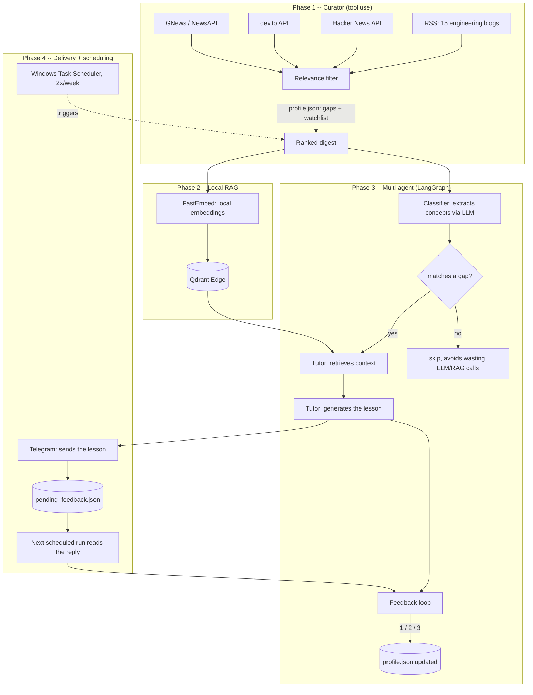

# Radar

Personal agent that turns technical news into short, practical lessons,
delivered via Telegram, prioritizing what you specifically don't know.
Built in 4 phases, each introducing a different agent engineering pattern:
tool use, RAG, multi-agent orchestration with LangGraph, and scheduled
asynchronous delivery.

**Why this project exists:** it's the umbrella project of a practical
learning plan to work as a freelance AI Engineer -- each phase was chosen
to cover an agent archetype that shows up frequently in real client
projects.

## Architecture



## Technical decisions (and why)

Data sources: free RSS feeds + APIs (Hacker News, dev.to) before scraping
or AI-powered search (Tavily/Exa) -- prioritizes zero cost and simplicity
for Phase 1; scraping/AI search remain logged as future expansion, not
blockers for the MVP.

Two-layer relevance filter: Phase 1 uses keyword heuristics (fast, no LLM
cost, delivers immediate value). Phase 3 replaces this with LLM-based
semantic classification, which fixes real limitations of the heuristic --
for example, substring matching producing false positives ("kubernetes
community practices" matching the "kubernetes" gap even though it doesn't
teach anything technical about the tool).

Qdrant Edge (not a full Qdrant Cloud/server): runs embedded in the
process, no extra infrastructure, appropriate for the volume of a
personal project -- disk footprint was estimated before implementing, not
after.

One level-up per topic per day cap: a real bug found in production -- 3
related lessons in the same run pushed a gap from level 0 to 3 at once,
which doesn't reflect real learning. Fixed with a simple rule
(`last_reviewed == today` blocks a further bump) and a documented 0-5
level scale in `profile.json` itself.

Telegram instead of WhatsApp: WhatsApp Business API requires business
verification and pre-approved templates to send proactive messages
outside a service window; Telegram has an open, free API with none of
those restrictions -- a better fit for the personal use case here.

Bot with no persistent server: each scheduled run first processes pending
feedback (via Telegram polling), then sends new lessons. Avoids keeping a
webhook or always-on service running on a personal machine just for a
low-volume bot.

## Phase 1 -- Curator agent (tool use)

Searches RSS, Hacker News, dev.to and GNews/NewsAPI, filters against
`config/profile.json` (your knowledge gaps + strategic watchlist).

### Setup

```bash
pip install -r requirements.txt
cp .env.example .env
# fill in GNEWS_API_KEY and NEWSAPI_KEY in .env
```

### Run

```bash
python main.py
```

Prints how many items each source contributed and a digest ranked by
relevance. RSS, HN and dev.to work without an API key.

## Phase 2 -- Local RAG base (Qdrant Edge + FastEmbed)

Stores the relevant items collected by Phase 1 in a local vector store
(Qdrant Edge, embedded in-process, no separate server), to anchor
educational explanations in Phase 3 instead of relying only on the LLM's
memory.

Embeddings are generated locally via FastEmbed (`BAAI/bge-small-en-v1.5`,
384 dimensions) -- the first run downloads the model (~130MB) and caches
it in `storage/fastembed_models/`. After that it runs offline.

### Populate the index

```bash
python -m rag.build_index
```

Runs the same search+filter pipeline from Phase 1 and indexes the
relevant items. Run it again whenever you want to refresh the base with
newer content -- reindexing the same URL just updates the existing point,
it doesn't duplicate.

### Test the search

```bash
python -m rag.query_index "kubernetes autoscaling"
```

Returns the 5 items semantically closest to your query, with title,
source and link.

### Where it's stored

```
storage/
  qdrant_edge/        # the local shard -- your actual data
  fastembed_models/    # cache of the downloaded embedding model
```

Note: Qdrant Edge pre-allocates 32MB of WAL per shard, so the folder may
show ~32MB even with little data -- that's reserved space, not actual
usage.

Qdrant Edge is in beta -- if any method/parameter of the `qdrant-edge-py`
package doesn't match exactly what's in `rag/index.py`, the API probably
changed version; check the official docs at
qdrant.tech/documentation/edge/.

## Structure

```
config/
  profile.json         # knowledge profile + strategic watchlist
  rss_sources.yaml      # curated engineering blogs, tagged by topic
tools/
  rss_source.py          # feedparser over rss_sources.yaml
  hn_source.py             # Hacker News via Algolia API (no key needed)
  devto_source.py           # dev.to API (no key needed)
  news_source.py              # GNews + NewsAPI (needs a key)
relevance.py                  # heuristic scoring -- becomes an LLM classifier in Phase 3
main.py                        # orchestrates Phase 1 and prints the digest
rag/
  index.py                       # Qdrant Edge + FastEmbed wrapper
  build_index.py                   # populates the base from the Phase 1 pipeline
  query_index.py                    # manual search test
storage/                             # local data (Qdrant Edge + model cache)
tutor/
  llm.py                          # Anthropic client wrapper
  graph.py                         # LangGraph graph: classifier + tutor + feedback
  run_lesson.py                     # Phase 3 entry point (terminal)
  telegram_bot.py                    # minimal Telegram API client
  pending.py                          # state of lessons awaiting feedback
  run_bot.py                           # Phase 4 entry point (Telegram, scheduled)
```

## Phase 3 -- Classifier + tutor + feedback loop (multi-agent)

A LangGraph graph with three roles:

1. **Classifier** -- asks the LLM (Anthropic) to extract the technical
   concepts from each item and cross-references them with the profile's
   `knowledge_gaps`.
2. **Tutor** -- if it matched a gap, retrieves context from the RAG base
   (Phase 2) and generates a short, practical explanation anchored in it.
3. **Feedback loop** -- asks your understanding level and updates
   `profile.json` (gap level, `last_reviewed`, `feedback_log`).

Items with no matched gap skip straight to the end (without wasting
LLM/RAG calls).

### Extra setup

```bash
# fill in .env:
ANTHROPIC_API_KEY=...
# optional, default is claude-sonnet-5:
ANTHROPIC_MODEL=claude-haiku-4-5-20251001
```

### Run

```bash
python -m tutor.run_lesson          # up to 3 lessons per round
python -m tutor.run_lesson --max 5  # adjust how many
```

Each item already evaluated once (logged in `feedback_log`) won't repeat
in future rounds. `profile.json` is rewritten at the end with updated
levels and log.

### About the multi-agent setup

The three roles run as nodes of a LangGraph `StateGraph`, not as separate
processes -- for a personal project this is enough and easier to debug
than true multi-process. `tutor/graph.py` has the graph commented
node-by-node if you want to understand the flow.

## Phase 4 -- Telegram bot + scheduling

Instead of running `tutor.run_lesson` in the terminal, the bot sends
lessons via Telegram and receives your feedback (1/2/3) by message, in a
scheduled run (e.g., 2x per week). No server running all the time -- each
scheduled run first processes pending feedback, then sends new lessons.

### Bot setup

1. On Telegram, talk to **@BotFather**, send `/newbot`, follow the
   instructions and copy the generated token.
2. Paste the token into `TELEGRAM_BOT_TOKEN` in `.env`.
3. Send any message to your bot on Telegram (it can't start the
   conversation).
4. Run:
   ```bash
   python -m tutor.telegram_bot
   ```
   This prints your `chat_id` -- paste it into `TELEGRAM_CHAT_ID` in
   `.env`.

### Run manually (test)

```bash
python -m tutor.run_bot          # up to 2 new lessons
python -m tutor.run_bot --max 1  # adjust how many
```

### Schedule 2x per week (Windows Task Scheduler)

Via command line (adjust the paths to your environment):

```powershell
schtasks /create /tn "Radar - Lessons" ^
  /tr "C:\path\to\python.exe -m tutor.run_bot" ^
  /sc weekly /d MON,THU /st 09:00 ^
  /rl LIMITED
```

Use the `python.exe` from inside your virtual environment (where you
installed `requirements.txt`), and set "Start in" (working directory) to
the project folder -- or run via a `.bat` that `cd`s into the folder
first. Alternative: `taskschd.msc` (GUI) to create the same task visually.

### How feedback gets matched to the right lesson

Since there's no process waiting for your reply in real time, each sent
lesson is logged in `storage/pending_feedback.json` until you respond. On
the next scheduled run, each numeric reply (1/2/3) received is applied to
the oldest pending lesson (FIFO) -- meaning you should reply in the same
order lessons arrived. For 2 lessons per round this is usually trivial in
practice.
